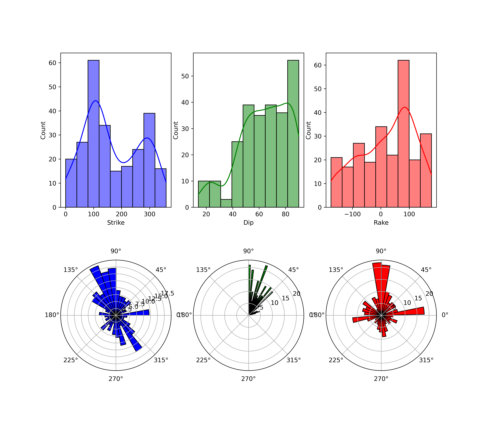

# REFNOS
Collection of python codes and scripts for visualizing the catalog of Moment Tensor inversions for Costa Rica. 

## First Steps:
The moment tensor inversions have been computed using
TDMT
FMNEAR
